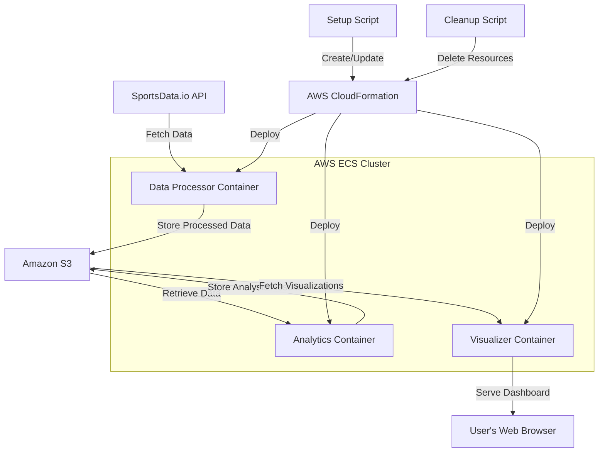

# NBA Dashboard Analytics Demo

## Overview
This demo showcases a containerized analytics pipeline for NBA data using Amazon Web Services (AWS). It demonstrates how to fetch, process, and visualize NBA statistics using serverless containers on AWS Elastic Container Service (ECS) with Fargate.

## Prerequisites
- An AWS account (free tier is sufficient)
- AWS CLI installed and configured on your local machine
- Basic understanding of AWS services (ECS, ECR, CloudFormation)
- A SportsData.io API key (free tier available)

## Project Structure
```
nba-dashboard-analytics/
├── data-processor/
│   ├── src/
│   ├── Dockerfile
│   └── requirements.txt
├── analytics/
│   ├── src/
│   ├── Dockerfile
│   └── requirements.txt
├── visualizer/
│   ├── src/
│   ├── static/
│   ├── templates/
│   ├── Dockerfile
│   └── requirements.txt
├── infrastructure/
│   ├── cloudformation/
│   └── scripts/
├── setup_project.sh
├── cleanup.sh
└── README.md
```

## Architecture

The following diagram illustrates the high-level architecture and data flow of the NBA Dashboard Analytics demo:



## Setup Instructions

1. Clone this repository:
   ```
   git clone https://github.com/your-repo/nba-dashboard-analytics.git
   cd nba-dashboard-analytics
   ```

2. Run the setup script:
   ```
   ./setup_project.sh
   ```
   This script will create necessary AWS resources and deploy the application.

3. When prompted, enter your SportsData.io API key or press Enter to use mock data.

4. Wait for the deployment to complete. The script will provide a URL for accessing the dashboard.

## Using the Dashboard

1. Open the provided URL in your web browser.
2. Navigate through the different visualizations of NBA data.
3. (Add specific instructions on how to interact with the dashboard)

## Cleanup

To remove all created AWS resources and avoid unnecessary charges:

1. Run the cleanup script:
   ```
   ./cleanup.sh
   ```

2. Confirm the deletion when prompted.

## Troubleshooting

- If you encounter issues, check the CloudWatch logs for each service.
- Ensure your AWS CLI is correctly configured with appropriate permissions.
- Verify that your SportsData.io API key is valid (if using real data).

## Learning Objectives

- Understanding containerized applications in AWS
- Implementing serverless container deployments with ECS Fargate
- Creating data processing pipelines in the cloud
- Visualizing data with web technologies

## Security Note

This is a demo application. In a production environment, you would need to implement additional security measures.

## Cost Estimation

Running this demo may incur AWS charges. Estimated costs:
- ECS Fargate: ~$X.XX per hour
- Other services: Minimal costs for ECR, CloudWatch, etc.

Remember to run the cleanup script to avoid ongoing charges.

## Support

For issues or questions, please open an issue in the GitHub repository.
